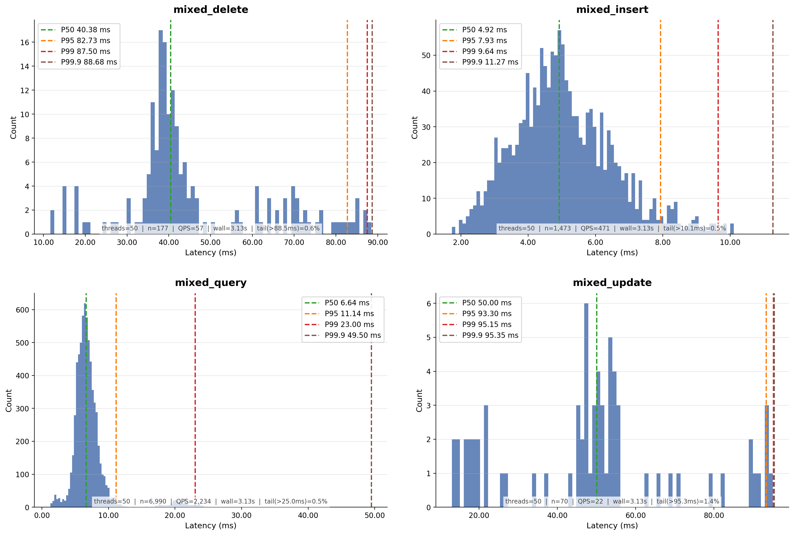

# Benchmark – Bucket Mixed with Load

See [Benchmark Deployment](../benchmark-deployment.md) for the host layout.

## Dataset

50,000 preloaded synthetic documents (same schema as the query benchmark). Mixed workload: 70% query, 15% insert, 10%
update, 5% delete. 10,000 total operations across 50 virtual threads.

## Command

```
java -jar kronotop-benchmark/target/kronotop-benchmark-2026.06-2.jar bucket mixed --host 172.31.8.56 --total-ops 10000 --preload-docs 50000 --threads 50 --output-dir latencies
```

## Result

```
=== Kronotop Bucket Mixed Benchmark ===
Host: 172.31.8.56:5484
Bucket: mixed-benchmark
Threads: 50
Total ops: 10,000
Preload docs: 50,000
Warmup per thread: 200
Op mix: QUERY=70%  INSERT=15%  UPDATE=10%  DELETE=5%
Delete limit: 5  Update limit: 5
Skip load: false
Output dir: latencies

Load complete: 50,000 docs in 5.7 sec (8708 docs/sec)

=== Mixed Benchmark Phase ===

MIXED results (8710 queries, 50 threads):
  Throughput:  2783.3 queries/sec
  Avg:         8.12 ms
  P50:         6.45 ms
  P95:         20.04 ms
  P99:         49.65 ms
  Min:         1.28 ms
  Max:         95.37 ms
  Duration:    3.13 sec

  Operation breakdown:
    QUERY     6990 ops ( 80.3%)  Avg:   7.38 ms  P50:   6.64 ms  P95:  11.15 ms  P99:  23.00 ms  Min:   1.28 ms  Max:  50.01 ms
    INSERT    1473 ops ( 16.9%)  Avg:   5.11 ms  P50:   4.92 ms  P95:   7.93 ms  P99:   9.76 ms  Min:   1.73 ms  Max:  47.11 ms
    UPDATE      70 ops (  0.8%)  Avg:  49.53 ms  P50:  49.75 ms  P95:  93.52 ms  P99:  95.37 ms  Min:  13.06 ms  Max:  95.37 ms
    DELETE     177 ops (  2.0%)  Avg:  45.79 ms  P50:  40.38 ms  P95:  83.38 ms  P99:  88.49 ms  Min:  11.64 ms  Max:  88.72 ms
    CONFLICT  1290 skipped ( 12.9% of attempts)
  Latencies written → /home/ubuntu/Code/kronotop/latencies/mixed_query_20260514_132829.csv
  Latencies written → /home/ubuntu/Code/kronotop/latencies/mixed_insert_20260514_132829.csv
  Latencies written → /home/ubuntu/Code/kronotop/latencies/mixed_update_20260514_132829.csv
  Latencies written → /home/ubuntu/Code/kronotop/latencies/mixed_delete_20260514_132829.csv

Benchmark complete.
```

## Notes

UPDATE latency is dominated by index updates and physically rewriting documents to the storage engine (including fsync).
DELETE carries the cost of index updates. Since all non-INSERT operations target the same dataset under 50 concurrent
threads, FoundationDB transaction conflicts are expected (12.9% of attempts). In production, conflicts are managed with
application-level retries — this benchmark does not retry.

## Latency Distribution

Latency histograms for each query scenario with percentile breakdowns.

