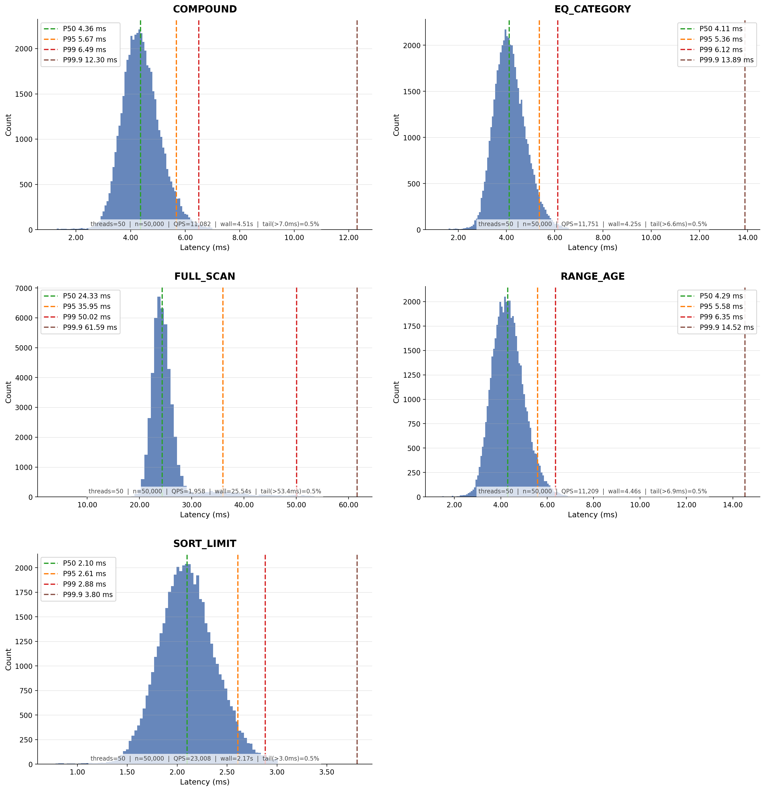

# Benchmark – Bucket Query with Load

See [Benchmark Deployment](../benchmark-deployment.md) for the host layout.

## Dataset

50,000 synthetic documents with fields: `category` (string), `age` (int32), `score` (double), `active` (boolean).
Indexes: single-field on `category`, `age`, `score`; compound index on `category` + `age`. Benchmark threads are virtual
threads.

## Command

```
java -jar kronotop-benchmark/target/kronotop-benchmark-2026.06-4.jar bucket query --host 172.31.8.56 --total-docs 50000 --threads 50 --queries 50000 --output-dir latencies
```

## Result

```
=== Kronotop Bucket Query Benchmark ===
Host: 172.31.8.56:5484
Bucket: query-benchmark
Threads: 50
Total docs: 50,000
Queries per scenario: 50,000 (total across all threads)
Warmup: 100 per thread (5,000 total)
Skip load: false

Indexes:
  Single-field: category (string), age (int32), score (double)
  Compound:     idx_category_age  (category: string, age: int32)
Load complete: 50,000 docs in 6.5 sec (7683 docs/sec)

=== Query Phase ===

Running FULL_SCAN: {active: true|false}  (active not indexed — full scan with default LIMIT)

FULL_SCAN results (50000 queries, 50 threads):
  Throughput:  1957.7 queries/sec
  Avg:         25.47 ms
  P50:         24.33 ms
  P95:         35.95 ms
  P99:         50.02 ms
  Min:         3.39 ms
  Max:         68.21 ms
  Duration:    25.54 sec
  Latencies written → /home/ubuntu/Code/kronotop/latencies/full_scan_20260514_130738.csv

Running EQ_CATEGORY: {category: <electronics|clothing|books|sports|food>}  LIMIT 100

EQ_CATEGORY results (50000 queries, 50 threads):
  Throughput:  11751.2 queries/sec
  Avg:         4.18 ms
  P50:         4.11 ms
  P95:         5.36 ms
  P99:         6.12 ms
  Min:         1.27 ms
  Max:         19.41 ms
  Duration:    4.25 sec
  Latencies written → /home/ubuntu/Code/kronotop/latencies/eq_category_20260514_130743.csv

Running RANGE_AGE: {age: {$gt: 20|30|40|50|60}}  LIMIT 100

RANGE_AGE results (50000 queries, 50 threads):
  Throughput:  11208.7 queries/sec
  Avg:         4.38 ms
  P50:         4.29 ms
  P95:         5.58 ms
  P99:         6.35 ms
  Min:         1.41 ms
  Max:         35.81 ms
  Duration:    4.46 sec
  Latencies written → /home/ubuntu/Code/kronotop/latencies/range_age_20260514_130748.csv

Running COMPOUND: {category: <electronics|clothing|books|sports|food>, age: {$gt: <30|40|30|50|25>}}  LIMIT 100

COMPOUND results (50000 queries, 50 threads):
  Throughput:  11081.7 queries/sec
  Avg:         4.44 ms
  P50:         4.36 ms
  P95:         5.67 ms
  P99:         6.49 ms
  Min:         1.14 ms
  Max:         36.70 ms
  Duration:    4.51 sec
  Latencies written → /home/ubuntu/Code/kronotop/latencies/compound_20260514_130753.csv

Running SORT_LIMIT: {category: <electronics|clothing|books|sports|food>}  SORTBY score ASC  LIMIT 10

SORT_LIMIT results (50000 queries, 50 threads):
  Throughput:  23007.5 queries/sec
  Avg:         2.11 ms
  P50:         2.10 ms
  P95:         2.61 ms
  P99:         2.88 ms
  Min:         0.75 ms
  Max:         5.84 ms
  Duration:    2.17 sec
  Latencies written → /home/ubuntu/Code/kronotop/latencies/sort_limit_20260514_130755.csv

Benchmark complete.
```

## Latency Distribution

Latency histograms for each query scenario with percentile breakdowns.

