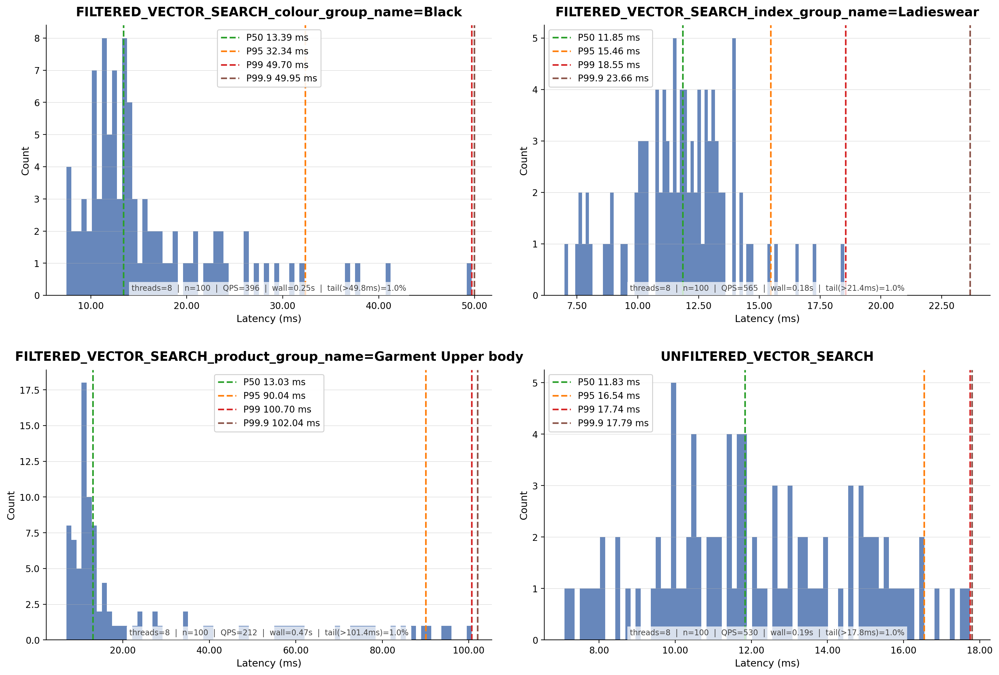

# Benchmark – Vector Search (H&M Products)

See [Benchmark Deployment](../benchmark-deployment.md) for the host layout.

Search uses `BUCKET.VECTOR`, which performs similarity search on a JVector-backed graph index with optional
post-filtering.
See [kronotop-benchmark](../../kronotop-benchmark/README.md) for dataset preparation and benchmark tool usage.

## Dataset

105,100 H&M product embeddings (2048 dimensions). Filter fields: `product_group_name`, `colour_group_name`,
`index_group_name`.
100 query vectors, top-K=10, 8 virtual threads.

## Command

```
java -jar kronotop-benchmark/target/kronotop-benchmark-2026.06-3.jar vector hnm --host 172.31.8.56 --threads 8 --search-rounds 100 --top-k 10 --data-dir ~/Code/hnm-data/
```

## Result

```
=== Kronotop Vector Search Benchmark (H&M) ===
Host: 172.31.8.56:5484
Bucket: hnm-products
Batch size: 50
Max docs: all
Search rounds: 100
Top-K: 10
Threads: 8

Session configured: INPUT_TYPE=JSON
Creating bucket: hnm-products
Bucket created successfully.
Loading data from: /home/ubuntu/Code/hnm-data/
Vectors shape: (105100, 2048)
Load complete: 105,100 docs in 345.6 sec (304 docs/sec)
Loading query vectors from tests.jsonl...
Loaded 100 query vectors.

--- Vector Search Benchmark (unfiltered) ---
Queries: 100, Top-K: 10, Threads: 8

Unfiltered vector search results (100 queries, 8 threads):
Throughput:  598.8 queries/sec
Avg:         10.92 ms
P50:         10.57 ms
P95:         16.54 ms
P99:         17.61 ms
Min:         6.58 ms
Max:         20.64 ms
Duration:    0.17 sec

--- Vector Search Benchmark (filtered: product_group_name=Garment Upper body, ~40% selectivity) ---
Queries: 100, Top-K: 10, Threads: 8

Filtered vector search (product_group_name=Garment Upper body) results (100 queries, 8 threads):
Throughput:  218.7 queries/sec
Avg:         30.05 ms
P50:         14.10 ms
P95:         91.65 ms
P99:         112.34 ms
Min:         6.95 ms
Max:         137.47 ms
Duration:    0.46 sec

--- Vector Search Benchmark (filtered: colour_group_name=Black, ~21% selectivity) ---
Queries: 100, Top-K: 10, Threads: 8

Filtered vector search (colour_group_name=Black) results (100 queries, 8 threads):
Throughput:  399.0 queries/sec
Avg:         16.39 ms
P50:         13.26 ms
P95:         34.31 ms
P99:         53.59 ms
Min:         7.76 ms
Max:         54.39 ms
Duration:    0.25 sec

--- Vector Search Benchmark (filtered: index_group_name=Ladieswear, specific category) ---
Queries: 100, Top-K: 10, Threads: 8

Filtered vector search (index_group_name=Ladieswear) results (100 queries, 8 threads):
Throughput:  561.8 queries/sec
Avg:         11.95 ms
P50:         11.63 ms
P95:         17.33 ms
P99:         19.54 ms
Min:         7.36 ms
Max:         20.76 ms
Duration:    0.18 sec

Benchmark complete.
```

## Latency Distribution

Latency histograms for each query scenario with percentile breakdowns.

