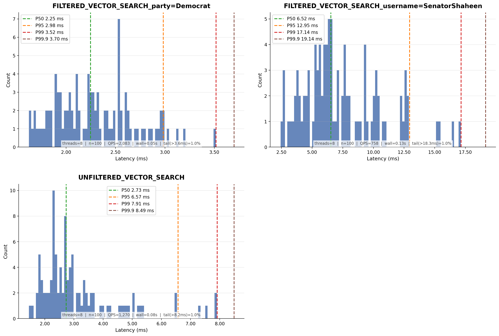

# Benchmark – Vector Search (Senator Tweets)

See [Benchmark Deployment](../benchmark-deployment.md) for the host layout.

Search uses `BUCKET.VECTOR`, which performs similarity search on a JVector-backed graph index with optional
post-filtering.
See [kronotop-benchmark](../../kronotop-benchmark/README.md) for dataset preparation and benchmark tool usage.

## Dataset

~80,000 Senator Tweet embeddings. Filter fields: `username`, `party`. 100 query vectors, top-K=10, 50 virtual threads.

## Command

```
java -jar kronotop-benchmark/target/kronotop-benchmark-2026.06-4.jar vector tweets --host 172.31.8.56 --threads 50 --search-rounds 100 --top-k 10 --data ~/senator-tweets/train.jsonl

```

## Result

```
=== Kronotop Vector Search Benchmark (Tweets) ===
Host: 172.31.8.56:5484
Bucket: senator-tweets
Batch size: 100
Max docs: all
Search rounds: 100
Top-K: 10
Threads: 50

Session configured: INPUT_TYPE=JSON
Creating bucket: senator-tweets
Bucket created successfully.
Loading data from: /home/ubuntu/senator-tweets/train.jsonl
Load complete: 79,754 docs in 56.0 sec (1424 docs/sec)

--- Vector Search Benchmark (unfiltered) ---
Queries: 100, Top-K: 10, Threads: 50

Unfiltered vector search results (100 queries, 50 threads):
  Throughput:  770.4 queries/sec
  Avg:         22.14 ms
  P50:         17.61 ms
  P95:         54.11 ms
  P99:         70.81 ms
  Min:         1.83 ms
  Max:         70.81 ms
  Duration:    0.13 sec

--- Vector Search Benchmark (filtered: username=SenatorShaheen, ~2.4% selectivity) ---
Queries: 100, Top-K: 10, Threads: 50

Filtered vector search (username=SenatorShaheen) results (100 queries, 50 threads):
  Throughput:  740.1 queries/sec
  Avg:         38.05 ms
  P50:         32.52 ms
  P95:         99.59 ms
  P99:         112.53 ms
  Min:         2.12 ms
  Max:         112.89 ms
  Duration:    0.14 sec

--- Vector Search Benchmark (filtered: party=Democrat, ~50% selectivity) ---
Queries: 100, Top-K: 10, Threads: 50

Filtered vector search (party=Democrat) results (100 queries, 50 threads):
  Throughput:  950.6 queries/sec
  Avg:         19.12 ms
  P50:         6.42 ms
  P95:         56.02 ms
  P99:         61.98 ms
  Min:         1.66 ms
  Max:         63.75 ms
  Duration:    0.11 sec

Benchmark complete.
```

## Latency Distribution

Latency histograms for each query scenario with percentile breakdowns.

